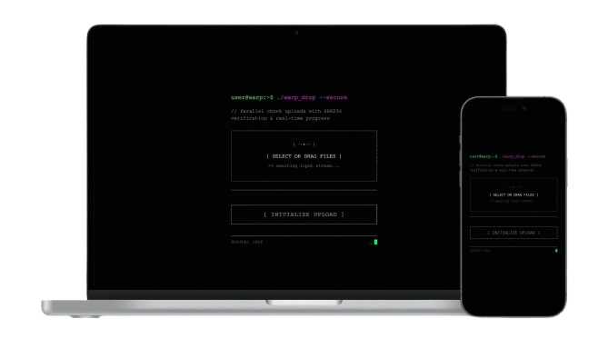

<div align="center">

# warp


File transfer tool for local networks with mDNS discovery, parallel uploads, and SHA256 verification.

[](https://pkg.go.dev/github.com/zulfikawr/warp)
[](https://go.dev/)
[](https://opensource.org/licenses/MIT)
[](https://github.com/zulfikawr/warp)

</div>

## Overview

Command-line tool for transferring files between devices on local networks. Provides HTTP server with automatic mDNS discovery, QR code generation, and end-to-end encryption enabled by default.

### Features

- **File Transfer:** Parallel chunk uploads, buffer pooling, zero-copy sendfile on Linux (unencrypted transfers only)
- **Transport:** TCP (HTTP/1.1) and QUIC/HTTP3 (UDP-based) for optimized local transfers
- **Modes:** Send files or host upload server
- **Security:** 
  - **End-to-End Encryption:** AES-256-GCM encryption enabled by default for all transfers
  - **PAKE (SPAKE2):** Secure key exchange using short human-readable codes
  - **Verification:** SHA256 checksums
  - **Hardening:** Filename sanitization (fuzz-tested), rate limiting for PAKE handshakes
- **Discovery:** mDNS/DNS-SD automatic service discovery
- **Monitoring:** Prometheus metrics with error tracking and session duration
- **Progress:** Real-time updates via WebSocket with pre-computed progress bars
- **Configuration:** YAML config, environment variables, CLI flags
- **Shell Integration:** Completion for bash, zsh, fish, PowerShell
- **Sharing:** Files, directories (auto-ZIP), text, stdin
- **Optimization:** Automatic zstd compression, in-memory caching with validation, checksum caching
- **Rate Limiting:** Per-client bandwidth control with automatic cleanup
- **Web UI:** Terminal-styled upload interface with drag-and-drop
- **Quality:** Comprehensive test suite, race detector clean, 95% allocation reduction

## Table of Contents

- [Installation](#installation)
- [Quick Start](#quick-start)
- [Commands](#commands)
- [Configuration](#configuration)
- [Features](#features)
- [Development](#development)
- [License](#license)

## Installation

### From Go Package

```bash
go install github.com/zulfikawr/warp/cmd/warp@latest
```

### From Source

Requires Go 1.25 or higher:

```bash
git clone https://github.com/zulfikawr/warp.git
cd warp
go build -o warp ./cmd/warp
sudo mv warp /usr/local/bin/
```

### Verify Installation

```bash
warp send --help
```

## Quick Start

Share a file (generates a secure PAKE code):

```bash
warp send myfile.zip
```

Receive a file using the code (auto-discovers sender):

```bash
warp receive --code 7-apple-velocity
```

Alternatively, receive via URL:

```bash
warp receive http://192.168.1.100:54321/d/abc123token
```

Discover servers:

```bash
warp search
```

## Commands

### `warp send`

Start server to share file, directory, or text.

| Flag           | Short | Type   | Default | Required | Description                                     |
| -------------- | ----- | ------ | ------- | -------- | ----------------------------------------------- |
| `--port`       | `-p`  | int    | random  | No       | Server port                                     |
| `--interface`  | `-i`  | string | auto    | No       | Network interface to bind                       |
| `--text`       |       | string |         | No       | Share text instead of file                      |
| `--stdin`      |       | bool   | false   | No       | Read text from stdin                            |
| `--rate-limit` |       | float  | 0       | No       | Bandwidth limit in Mbps (0 = unlimited)         |
| `--cache-size` |       | int    | 100     | No       | File cache size in MB                           |
| `--no-qr`      |       | bool   | false   | No       | Skip QR code display                            |
| `--no-encrypt` |       | bool   | false   | No       | Disable encryption (not recommended)             |
| `--verbose`    | `-v`  | bool   | false   | No       | Verbose logging                                 |

**Arguments:**

- `<path>` - File or directory to share (required unless `--text` or `--stdin`)

**Examples:**

```bash
warp send document.pdf
warp send ./myproject/
warp send --text "Hello, World!"
echo "data" | warp send --stdin
warp send -p 9000 file.zip
warp send --rate-limit 10 video.mp4
warp send --no-encrypt public.pdf
```

**Output:**

```
Server started on :54321
PAKE Code: 7-apple-velocity
Service: warp-abc123._warp._tcp.local.
Local URL: http://192.168.1.100:54321/d/abc123token
Metrics: http://192.168.1.100:54321/metrics

Scan QR code on another device:
[QR Code]

Tip: Open the URL in any browser to download

Press Ctrl+C to stop server
```

---

### `warp host`

Start server to receive file uploads.

| Flag           | Short | Type   | Default | Required | Description                       |
| -------------- | ----- | ------ | ------- | -------- | --------------------------------- |
| `--interface`  | `-i`  | string | auto    | No       | Network interface to bind         |
| `--dest`       | `-d`  | string | `.`     | No       | Destination directory for uploads |
| `--rate-limit` |       | float  | 0       | No       | Bandwidth limit in Mbps           |
| `--no-qr`      |       | bool   | false   | No       | Skip QR code display              |
| `--no-encrypt` |       | bool   | false   | No       | Disable encryption (not recommended) |
| `--verbose`    | `-v`  | bool   | false   | No       | Verbose logging                   |

**Examples:**

```bash
warp host
warp host -d ./uploads
warp host -i eth0 -d ./downloads
warp host --rate-limit 50
warp host --no-encrypt -d ./public
```

**Output:**

```
Hosting uploads to './uploads'
Token: abc123token
Features: Parallel chunks, SHA256 verification, WebSocket progress

Scan QR code to upload from mobile:
[QR Code]

Tip: Drag and drop files in the browser

Open this on another device to upload:
http://192.168.1.100:54321/u/abc123token
```

### Web Upload Interface

Access the `/upload` endpoint in any browser for a terminal-styled upload interface.

<div align="center">



</div>

**Features:**

- **Terminal UI Design**: Retro ASCII-styled interface with ANSI colors
- **Drag & Drop**: Drop files anywhere or click to select
- **Multiple Files**: Upload multiple files simultaneously
- **Parallel Chunks**: Configurable workers (default: 3) and chunk size (default: 2MB)
- **Real-time Progress**:
  - Per-file progress bars
  - Live upload speed in Mbps
  - WebSocket connection status indicator
  - Percentage and status updates
- **Upload Controls**:
  - Pause/resume individual uploads with `[||]` / `[>]` buttons
  - Cancel uploads with `[x]` button
  - Per-file speed monitoring
- **SHA256 Verification**: Automatic checksum validation server-side
- **Session Management**: Unique session IDs prevent chunk conflicts
- **Status Indicators**:
  - WebSocket connection status (green = connected)
  - Real-time upload state (WAITING, UPLOADING, PAUSED, COMPLETE, ERROR)
  - Blinking cursor animation

**Technical Details:**

- Zero dependencies (vanilla JavaScript)
- Responsive design for mobile/desktop
- Exponential moving average for smooth speed display
- Automatic chunk retry on failure
- Session-based upload tracking

---

### `warp receive`

Download file from warp server using a URL or PAKE code.

| Flag            | Short | Type   | Default | Required | Description                  |
| --------------- | ----- | ------ | ------- | -------- | ---------------------------- |
| `--code`        | `-c`  | string |         | No       | PAKE code for secure transfer|
| `--output`      | `-o`  | string |         | No       | Output filename or directory |
| `--force`       | `-f`  | bool   | false   | No       | Overwrite existing files     |
| `--workers`     |       | int    | 3       | No       | Parallel download workers    |
| `--chunk-size`  |       | int    | 2       | No       | Chunk size in MB             |
| `--no-checksum` |       | bool   | false   | No       | Skip SHA256 verification     |
| `--decrypt`     |       | bool   | false   | No       | Decrypt with password        |
| `--verbose`     | `-v`  | bool   | false   | No       | Verbose logging              |

**Arguments:**

- `<url>` - Server URL (optional if `--code` is used)

**Examples:**

```bash
warp receive --code 7-apple-velocity
warp receive http://192.168.1.100:54321/d/abc123token
warp receive http://host:port/d/token -o myfile.zip
warp receive http://host:port/d/token -f
warp receive http://host:port/d/token --workers 5
warp receive http://host:port/d/token --no-checksum
warp receive http://host:port/d/token --decrypt
```

**Output:**

```
Downloading: document.pdf (15.2 MB)
[====================] 100% | 15.2 MB/15.2 MB | 45.6 MB/s | Time: 0s | ETA: 0s

Transfer Complete

Summary:
  File:         document.pdf
  Size:         15.2 MB
  Time:         0.3s
  Avg Speed:    50.7 MB/s
  Saved to:     document.pdf
  Checksum:     Verified
```

---

### `warp search`

Discover warp servers on local network via mDNS.

| Flag        | Short | Type     | Default | Required | Description       |
| ----------- | ----- | -------- | ------- | -------- | ----------------- |
| `--timeout` |       | duration | 3s      | No       | Discovery timeout |

**Examples:**

```bash
warp search
warp search --timeout 5s
warp search --timeout 100ms
```

**Output:**

```
Searching for warp services on local network...

Found 2 services:

1. warp-macbook
   Host: macbook.local.
   Address: 192.168.1.100:54321
   URL: http://192.168.1.100:54321

2. warp-desktop
   Host: desktop.local.
   Address: 192.168.1.101:54321
   URL: http://192.168.1.101:54321
```

---

### `warp speedtest`

Test network speed (upload/download/latency) to a target host.

| Flag        | Short | Type     | Default | Required | Description               |
| ----------- | ----- | -------- | ------- | -------- | ------------------------- |
| `--timeout` |       | duration | 30s     | No       | Timeout for the speed test |

**Arguments:**

- `<host>` - Target host to test (e.g., `192.168.1.100` or `example.com:8080`)

**Examples:**

```bash
warp speedtest 192.168.1.100
warp speedtest 192.168.1.100:54321
warp speedtest example.com:8080 --timeout 1m
```

**Output:**

```
Running network speed test to 192.168.1.100:54321...

Upload:    125 Mbps     [====================]
Download:  98 Mbps      [====================]
Latency:   12ms         ✓ Excellent

Your network can transfer:
  • 100 MB file in ~8 seconds
  • 1 GB file in ~1 min 23 sec
  • 10 GB file in ~13 min 50 sec
```
---

### `warp config`

Manage configuration file.

**Subcommands:**

- `init` - Initialize configuration interactively
- `show` - Display current configuration
- `edit` - Open config in $EDITOR (defaults to vi)
- `path` - Show config file location

**Examples:**

```bash
warp config init
warp config show
warp config edit
warp config path
```

---

### `warp completion`

Generate shell completion scripts.

**Subcommands:**

- `bash` - Bash completion
- `zsh` - Zsh completion
- `fish` - Fish completion
- `powershell` - PowerShell completion

**Examples:**

```bash
warp completion bash > /etc/bash_completion.d/warp
warp completion zsh > /usr/local/share/zsh/site-functions/_warp
warp completion fish > ~/.config/fish/completions/warp.fish
warp completion powershell > warp.ps1
```

## Configuration

### Configuration File

Location: `~/.config/warp/warp.yaml`

| Setting             | Type   | Default            | Description                     |
| ------------------- | ------ | ------------------ | ------------------------------- |
| `default_interface` | string | auto-detect        | Network interface to bind       |
| `default_port`      | int    | 0 (random)         | Server port                     |
| `buffer_size`       | int    | 1048576 (1MB)      | I/O buffer size in bytes        |
| `max_upload_size`   | int64  | 10737418240 (10GB) | Maximum upload size in bytes    |
| `rate_limit_mbps`   | float  | 0 (unlimited)      | Bandwidth limit in Mbps         |
| `cache_size_mb`     | int64  | 100                | File cache size in MB           |
| `chunk_size_mb`     | int    | 2                  | Chunk size for parallel uploads |
| `parallel_workers`  | int    | 3                  | Number of parallel workers      |
| `no_qr`             | bool   | false              | Skip QR code display            |
| `no_checksum`       | bool   | false              | Skip SHA256 verification        |
| `upload_dir`        | string | `.`                | Default upload directory        |

**Example:**

```yaml
default_interface: ""
default_port: 0
buffer_size: 1048576
max_upload_size: 10737418240
rate_limit_mbps: 0
cache_size_mb: 100
chunk_size_mb: 2
parallel_workers: 3
no_qr: false
no_checksum: false
upload_dir: "."
```

### Environment Variables

Override config with `WARP_` prefix:

```bash
export WARP_DEFAULT_PORT=9000
export WARP_RATE_LIMIT_MBPS=10
export WARP_CACHE_SIZE_MB=200
warp send file.zip
```

### Precedence

1. Command-line flags (highest)
2. Environment variables
3. Configuration file
4. Default values (lowest)

## Features

### QUIC/HTTP3 Support

**v1.1.0** introduces dual-protocol support for optimized local network transfers.

Warp automatically starts both:

1. **TCP/HTTP/1.1 Server** - Traditional reliable connection for maximum compatibility
2. **QUIC/HTTP/3 Server** - UDP-based protocol running on the same port, providing:
   - **Head-of-Line Blocking Elimination:** Multiple parallel streams don't block each other
   - **Faster Connection Establishment:** 0-RTT handshake for reduced latency
   - **Optimized for Parallel Transfers:** Ideal for warp's multi-chunk upload feature

**Performance Benefits:**

- Reduced latency for high-bandwidth local transfers
- Better performance when transferring multiple files or parallel chunks
- Self-signed certificates automatically generated for local transfers

**Automatic Protocol Selection:**

- Clients automatically detect and use QUIC when available
- Falls back to TCP if QUIC is unavailable or blocked
- No configuration needed - both protocols run simultaneously on startup

**Note:** QUIC/HTTP3 uses self-signed certificates suitable for trusted local networks. For production deployments, use proper CAs.

```bash
# Both protocols active automatically
warp send largefile.iso
# Sender uses either TCP or QUIC based on network conditions
```

### Encryption

AES-256-GCM encryption with SPAKE2 PAKE key exchange. **Enabled by default** on all transfers.

```bash
# Encrypted transfer (default)
warp send secret.pdf
warp receive --code 7-apple-velocity

# Unencrypted transfer (if needed)
warp send --no-encrypt public.pdf
warp receive http://host:port/d/token
```

**Specifications:**

- Default: **Encrypted** via PAKE (SPAKE2) key exchange
- Algorithm: AES-256-GCM
- Key Exchange: SPAKE2 (Password-Authenticated Key Exchange)
- Key Derivation: Derived from PAKE shared secret
- Nonce: 12 bytes (8-byte counter + 4-byte random per chunk)
- Per-Chunk Authentication: 16-byte GCM tag
- Chunk Limit: 4,294,967,296 chunks (~8TB at 64KB chunks) with automatic exhaustion protection
- Verification: SHA256 checksum after decryption

**Performance Notes:**

- **Encrypted transfers**: Stream encryption on-the-fly, no disk overhead
- **Unencrypted transfers on Linux**: Use zero-copy sendfile for maximum throughput (~250 MB/s)
- **Encrypted transfers**: Optimized EncryptReader for efficient encryption (~220 MB/s typical)
- Why no sendfile with encryption? Sendfile is a kernel-level operation that copies disk bytes directly to network without CPU processing. Encryption requires on-the-fly transformation of every byte, so these are fundamentally incompatible. The tradeoff is intentional: **security by default** takes priority over kernel-level optimization.

### Metrics

Prometheus metrics at `/metrics` endpoint.

**Key Metrics:**

- `warp_uploads_total`, `warp_downloads_total`
- `warp_upload_duration_seconds`, `warp_download_duration_seconds`
- `warp_active_uploads`, `warp_active_downloads`
- `warp_chunk_uploads_total`
- `warp_cache_hits_total`, `warp_cache_misses_total`
- `warp_checksum_verifications_total`
- `warp_websocket_connections`
- `warp_errors_total` - Error tracking by type and operation
- `warp_retry_attempts_total` - Retry monitoring
- `warp_session_duration_seconds` - Session duration histograms

### Parallel Uploads

Files split into chunks for parallel transfer.

**Defaults:**

- Workers: 3
- Chunk size: 2 MB

**Configure:**

```bash
warp receive http://host:port/d/token --workers 5 --chunk-size 4
```

### Compression

**Automatic zstd:**

- Applied to text/compressible files
- Requires client support
- Minimum size: 1KB

**Supported:** `.txt`, `.json`, `.xml`, `.html`, `.css`, `.js`, `.csv`, `.log`, `.md`, `.yaml`, `.yml`, `.svg`, `.sql`, `.sh`, `.bat`, `.ps1`

**Directory ZIP:**
Directories auto-stream as ZIP with deflate compression.

### File Caching

In-memory cache for files < 10MB.

**Defaults:**

- Cache size: 100MB
- Validation: file modification time

**Configure:**

```bash
warp send file.zip --cache-size 200
```

### Rate Limiting

Per-client bandwidth control.

```bash
warp send video.mp4 --rate-limit 10
warp host --rate-limit 50 -d ./uploads
```

### Progress Tracking

Real-time progress with WebSocket updates.

**Terminal:**

```
Downloading: file.zip (1.2 GB)
[============        ] 65% | 780 MB/1.2 GB | 42.3 MB/s | Time: 18s | ETA: 10s
```

**Web UI:**

- Drag-and-drop
- Real-time progress bars
- Speed indicators
- Multiple file support

## API

### Endpoints

| Method | Path                 | Description                     |
| ------ | -------------------- | ------------------------------- |
| GET    | `/d/{token}`         | Download file                   |
| POST   | `/upload/chunk`      | Upload file chunk               |
| GET    | `/api/info`          | Server and file info            |
| GET    | `/ws/progress`       | WebSocket progress updates      |
| GET    | `/metrics`           | Prometheus metrics              |
| GET    | `/upload`            | Web upload interface            |
| GET    | `/speedtest/download`| Speed test download endpoint    |
| POST   | `/speedtest/upload`  | Speed test upload endpoint      |
| GET    | `/health`            | Health check endpoint           |

### Headers

**Download (`GET /d/{token}`):**

- Response: `X-Checksum-SHA256` - File SHA256 hash

**Upload (`POST /upload/chunk`):**

- Request: `X-Upload-Session` - Session ID
- Request: `X-Chunk-Index` - Chunk index (0-based)
- Request: `X-Chunk-Offset` - Byte offset
- Request: `X-Total-Chunks` - Total chunks
- Request: `X-File-Name` - Filename

### Protocol Flow

**Download:**

1. Server generates token, advertises via mDNS
2. Client discovers or receives URL
3. Client GET `/d/{token}`
4. Server streams file (zero-copy on Linux)
5. Client verifies SHA256 checksum

**Upload:**

1. Client generates session ID
2. Client GET `/api/info`
3. Client splits file into chunks
4. Client POST `/upload/chunk` (parallel)
5. Server assembles and verifies checksum

## Architecture

### Components

| Component     | Location              | Purpose                                                             |
| ------------- | --------------------- | ------------------------------------------------------------------- |
| **Server**    | `internal/server/`    | HTTP server, WebSocket, parallel chunks, zero-copy sendfile (Linux), PAKE |
| **Client**    | `internal/client/`    | HTTP client, parallel downloads, checksums, progress tracking, PAKE       |
| **Crypto**    | `internal/crypto/`    | Token generation, AES-256-GCM, SPAKE2, wordlist                           |
| **Discovery** | `internal/discovery/` | mDNS/DNS-SD advertisement and browsing                              |
| **UI**        | `internal/ui/`        | Progress bars, QR codes, speed/ETA                                  |
| **Config**    | `internal/config/`    | YAML parsing, environment variables                                 |
| **Metrics**   | `internal/metrics/`   | Prometheus metrics (upload, download, cache, session, WebSocket)    |
| **Network**   | `internal/network/`   | Network utilities, IP discovery                                     |
| **Protocol**  | `internal/protocol/`  | Transfer metadata, constants, buffer sizing, protocol definitions   |
| **Logging**   | `internal/logging/`   | Structured logging                                                  |

### Project Structure

```
warp/
├── cmd/warp/                         # CLI application
│   ├── main.go                       # Entry point (62 lines)
│   ├── commands/                     # Command implementations
│   │   ├── send.go                   # Send command
│   │   ├── receive.go                # Receive command
│   │   ├── host.go                   # Host command
│   │   ├── search.go                 # Search command
│   │   ├── speedtest.go              # Speedtest command
│   │   ├── config.go                 # Config command
│   │   └── utils.go                  # Command utilities
│   ├── completion/                   # Shell completions
│   │   ├── bash.go                   # Bash completion
│   │   ├── zsh.go                    # Zsh completion
│   │   ├── fish.go                   # Fish completion
│   │   └── powershell.go             # PowerShell completion
│   └── ui/                           # CLI UI components
│       ├── colors.go                 # Color scheme management
│       └── help.go                   # Help text formatting
├── internal/
│   ├── client/                       # Download client
│   │   ├── client.go                 # Shared HTTP client configuration
│   │   ├── receiver.go               # HTTP client with dependency injection
│   │   ├── receiver_test.go
│   │   ├── uploader.go               # Parallel uploader with buffer pooling
│   │   ├── uploader_test.go
│   │   └── pake.go                   # PAKE client-side handshake
│   ├── errors/                       # Error handling
│   │   └── errors.go                 # UserError type with suggestions
│   ├── server/                       # HTTP server
│   │   ├── server.go                 # Server lifecycle, core handlers
│   │   ├── download.go               # Download handler with compression, rate limiting
│   │   ├── upload.go                 # Multipart & raw upload handlers
│   │   ├── chunks.go                 # Parallel chunk upload processing
│   │   ├── session.go                # Upload session management
│   │   ├── cache.go                  # Buffer pools, checksum caching
│   │   ├── progress.go               # Multi-file progress display
│   │   ├── websocket.go              # Real-time progress streaming
│   │   ├── ratelimit.go              # Per-client rate limiting
│   │   ├── sanitize.go               # Filename sanitization (fuzz-tested)
│   │   ├── validate.go               # Input validation for uploads
│   │   ├── embed.go                  # HTML template embedding
│   │   ├── speedtest.go              # Speed test endpoints
│   │   ├── pake.go                   # PAKE server-side handlers
│   │   ├── http_linux.go             # Zero-copy sendfile (offset fix)
│   │   ├── http_other.go             # Non-Linux fallback
│   │   ├── constants.go              # Configuration constants
│   │   ├── zip.go                    # Directory compression
│   │   ├── server_test.go
│   │   ├── leak_test.go              # Goroutine leak tests
│   │   ├── fuzz_test.go              # Fuzz testing (239K+ iterations)
│   │   └── static/upload.html        # Web UI
│   ├── crypto/                       # Encryption, tokens
│   │   ├── encrypt.go                # AES-256-GCM with nonce protection
│   │   ├── encrypt_test.go
│   │   ├── encrypt_nonce_test.go     # Nonce exhaustion tests
│   │   ├── token.go
│   │   ├── token_test.go
│   │   ├── pake.go                   # SPAKE2 implementation wrapper
│   │   └── wordlist.go               # 1024-word dictionary for codes
│   ├── discovery/                    # mDNS/DNS-SD (race-free)
│   │   ├── discovery.go
│   │   └── discovery_test.go
│   ├── network/                      # Network utilities
│   │   ├── ip.go
│   │   └── ip_test.go
│   ├── protocol/                     # Protocol definitions & constants
│   │   ├── constants.go              # Buffer sizes, thresholds, intervals
│   │   ├── metadata.go               # Transfer metadata & validation
│   │   ├── handshake.go              # Protocol handshake
│   │   └── handshake_test.go
│   ├── ui/                           # Progress, QR codes
│   │   ├── progress.go               # Pre-computed progress bars
│   │   ├── qr.go
│   │   └── ui_test.go
│   ├── config/                       # Configuration with error handling
│   │   ├── config.go
│   │   └── config_test.go
│   ├── metrics/                      # Prometheus metrics (modular)
│   │   ├── metrics.go                # Package documentation
│   │   ├── upload.go                 # Upload performance metrics
│   │   ├── download.go               # Download performance metrics
│   │   ├── chunks.go                 # Parallel chunk metrics
│   │   ├── session.go                # Session & error tracking
│   │   ├── cache.go                  # Cache performance metrics
│   │   ├── websocket.go              # WebSocket metrics
│   │   ├── http.go                   # HTTP & rate limiting
│   │   └── metrics_test.go
│   ├── speedtest/                    # Network speed testing
│   │   ├── speedtest.go              # Speed test implementation
│   │   └── speedtest_test.go         # Speed test unit tests
│   └── logging/                      # Lazy initialization logging
│       ├── logger.go
│       └── logger_test.go
├── test/e2e_test.go                  # End-to-end tests
├── CHANGELOG.md                      # Version history
├── go.mod
└── README.md
```

## Development

### Build

```bash
go build -o warp ./cmd/warp

# Specific platform
GOOS=linux GOARCH=amd64 go build -o warp-linux-amd64 ./cmd/warp
GOOS=darwin GOARCH=arm64 go build -o warp-darwin-arm64 ./cmd/warp
GOOS=windows GOARCH=amd64 go build -o warp-windows.exe ./cmd/warp
```

### Test

```bash
# All tests
go test ./...

# With race detector (recommended)
go test -race ./...

# With coverage
go test -cover ./...

# Specific package
go test -v ./internal/crypto

# Fuzz testing (filename sanitization)
go test -fuzz=FuzzSanitizeFilename -fuzztime=30s ./internal/server/

# Leak detection tests
go test -v -run TestServer_NoGoroutineLeaks ./internal/server/

# Nonce exhaustion tests
go test -v -run TestEncryptReader_NonceExhaustion ./internal/crypto/

# End-to-end
go test -v ./test

# Coverage report
go test -coverprofile=coverage.out ./...
go tool cover -html=coverage.out
```

**Test Suite:**

- **Security:** Nonce exhaustion protection, filename sanitization (fuzz-tested with 239K+ iterations)
- **Reliability:** Goroutine leak detection, rate limiter cleanup, checksum cache validation
- **Concurrency:** Race detector clean across all packages
- **Quality:** Comprehensive unit tests, integration tests, end-to-end tests

### Code Quality

```bash
go fmt ./...          # Format
go vet ./...          # Vet
go mod tidy           # Clean dependencies
```

## Contributing

See [CONTRIBUTING.md](CONTRIBUTING.md).

1. Fork repository
2. Create feature branch
3. Add tests
4. Run `go test ./...`
5. Commit changes
6. Create Pull Request

## License

MIT License - see [LICENSE](LICENSE).

## Dependencies

- [Gorilla WebSocket](https://github.com/gorilla/websocket)
- [Zeroconf](https://github.com/grandcat/zeroconf)
- [Prometheus Go client](https://github.com/prometheus/client_golang)
- [go-qrcode](https://github.com/skip2/go-qrcode)
- [Viper](https://github.com/spf13/viper)
- [Zap](https://go.uber.org/zap)
- [Go crypto](https://golang.org/x/crypto)

---

**Issues:** [GitHub Issues](https://github.com/zulfikawr/warp/issues)
