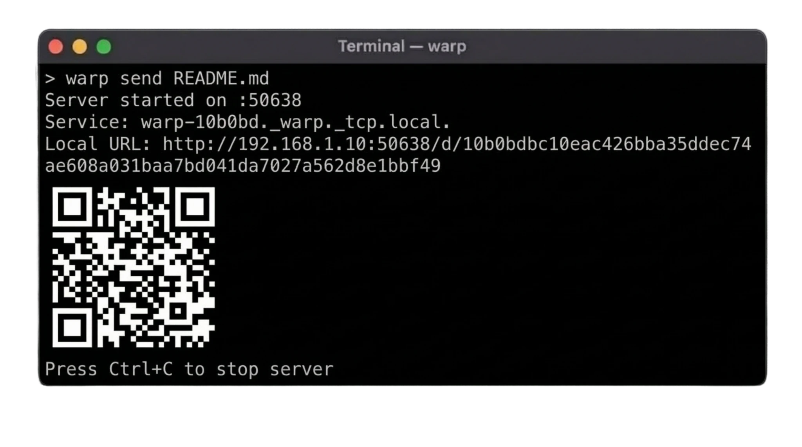

<div align="center">

# warp



Fast, secure file transfer tool for local networks with encryption, progress tracking, and monitoring capabilities, written in Go.

[](https://pkg.go.dev/github.com/zulfikawr/warp)
[](https://go.dev/)
[](https://opensource.org/licenses/MIT)
[](https://github.com/zulfikawr/warp)

</div>

## Overview

warp is a command-line tool for transferring files between devices on local networks. It provides a simple HTTP server with automatic mDNS discovery, QR code generation for easy sharing, and optional AES-256-GCM encryption. Designed for developers and system administrators who need reliable file transfers with observability and security.

### Key Features

- **Fast Transfers**: Zero-copy sendfile on Linux, parallel chunk uploads with configurable workers
- **Bidirectional**: Send files (download mode) or host uploads (upload server mode)
- **Security**: AES-256-GCM encryption with PBKDF2 key derivation, SHA256 checksum verification
- **Discovery**: Automatic mDNS/DNS-SD service discovery on local networks
- **Monitoring**: Prometheus metrics endpoint with 15+ metrics for transfers, performance, and system health
- **Progress Tracking**: Real-time progress bars with ETA, speed indicators, and WebSocket updates
- **Configuration**: YAML config files, environment variables, and command-line flag overrides
- **Shell Integration**: Completion scripts for bash, zsh, fish, and PowerShell
- **Cross-Platform**: Linux, macOS, and Windows support with platform-specific optimizations
- **Flexible Content**: Share files, directories (auto-ZIP), text snippets, or stdin streams
- **Compression**: Automatic gzip compression for compressible files, ZIP for directories
- **File Caching**: Intelligent in-memory caching for faster repeated transfers
- **Bandwidth Control**: Configurable rate limiting for uploads and downloads
- **Web Interface**: Drag-and-drop HTML UI for browser-based uploads

## Table of Contents

- [How It Works](#how-it-works)
- [Use Cases](#use-cases)
- [Installation](#installation)
- [Quick Start](#quick-start)
- [Usage](#usage)
  - [Sending Files](#sending-files)
  - [Receiving Files](#receiving-files)
  - [Discovery](#discovery)
  - [Configuration](#configuration)
- [Features](#features)
  - [Encryption](#encryption)
  - [Metrics](#metrics)
  - [Progress Tracking](#progress-tracking)
  - [Parallel Uploads](#parallel-uploads)
- [Architecture](#architecture)
- [Configuration Reference](#configuration-reference)
- [API Documentation](#api-documentation)
- [Development](#development)
- [Contributing](#contributing)
- [License](#license)

## How It Works

warp operates as a temporary HTTP server for file transfers on local networks:

1. **Server Mode**: When sending files, warp starts an HTTP server on a specified or random port, generates a unique access token, and advertises the service via mDNS for local discovery. The server displays a QR code and URL for recipients to access the file.

2. **Client Mode**: When receiving files, warp connects to the provided URL, downloads the file using HTTP, and verifies integrity with SHA256 checksums. Large files are split into chunks and downloaded in parallel for improved performance.

3. **Host Mode**: When hosting uploads, warp starts an HTTP server with a web interface at `/upload` where users can drag-and-drop files. Uploads are processed in parallel chunks, tracked via WebSocket connections, and saved to the specified destination directory.

4. **Discovery**: Services are advertised using mDNS/DNS-SD (Bonjour/Avahi) on the local network. The `warp search` command browses for active services and displays available servers.

5. **Encryption**: When encryption is enabled, files are encrypted with AES-256-GCM before transmission. Keys are derived from user-provided passwords using PBKDF2 with 100,000 iterations. Each chunk uses a unique nonce for security.

6. **Monitoring**: The `/metrics` endpoint exposes Prometheus-compatible metrics for tracking transfer statistics, performance, cache efficiency, and system health.

## Use Cases

**Development and Testing**
- Transfer build artifacts between development machines
- Share log files and debug dumps with team members
- Distribute test datasets across testing environments
- Stream application output to remote machines via stdin

**System Administration**
- Deploy configuration files to multiple servers
- Collect diagnostic information from remote systems
- Transfer backup files between storage locations
- Share scripts and automation tools across infrastructure

**DevOps and CI/CD**
- Monitor file transfer performance with Prometheus integration
- Automate secure file distribution in deployment pipelines
- Track transfer metrics for capacity planning
- Integrate with monitoring dashboards via metrics endpoint

**Team Collaboration**
- Share large files that exceed email attachment limits
- Distribute design assets and documentation within teams
- Transfer sensitive files with encryption on trusted networks
- Collect uploads from team members via web interface

**General File Sharing**
- Quick file transfers between personal devices on home networks
- Share files in office environments without external services
- Transfer files in air-gapped or restricted networks
- Temporary file sharing without permanent storage

## Installation

### From Go Repository

```bash
go install github.com/zulfikawr/warp@v1.0.0
```

### From Source

Requires Go 1.25.4 or higher:

```bash
git clone https://github.com/zulfikawr/warp.git
cd warp
go build -o warp ./cmd/warp
sudo mv warp /usr/local/bin/
```

### Verify Installation

```bash
warp version
warp help
```

## Quick Start

### Send a File

```bash
# Start server and share a file
warp send myfile.zip

# Server starts on port 8080 (default)
# Displays QR code and URL for recipients
```

### Receive a File

```bash
# Download from the provided URL
warp receive http://192.168.1.100:8080/d/abc123token
```

### Local Discovery

```bash
# Find active warp servers on the network
warp search

# Connect to discovered server
warp receive warp://hostname
```

## Usage

### Sending Files

Start an HTTP server to share files or text:

```bash
# Share a file
warp send document.pdf

# Share with encryption
warp send document.pdf --encrypt

# Share text content
warp send --text "Hello, World!"

# Read from stdin
echo "Hello from pipe" | warp send --stdin
cat script.sh | warp send --stdin

# Share directory (auto-zipped)
warp send /path/to/directory

# Custom port
warp send file.zip --port 9000

# Limit bandwidth
warp send video.mp4 --rate-limit 10

# Set file cache size
warp send largefile.iso --cache-size 200

# Skip QR code
warp send file.zip --no-qr
```

**Available Flags:**

- `-p, --port <port>` - Server port (default: random)
- `-i, --interface <name>` - Bind to specific network interface
- `-t, --text <content>` - Share text instead of file
- `--stdin` - Read text content from stdin
- `--rate-limit <mbps>` - Limit download bandwidth in Mbps (0 = unlimited)
- `--cache-size <mb>` - File cache size in MB (default: 100)
- `--no-qr` - Skip printing QR code
- `--encrypt` - Encrypt transfer with password
- `-v, --verbose` - Enable verbose logging

**Output:**

```
Server started on :8080
Service: warp-macbook._warp._tcp.local.
Local URL: http://192.168.1.100:8080/d/abc123token
Metrics: http://192.168.1.100:8080/metrics

[QR Code displayed in terminal]

Press Ctrl+C to stop server
```

### Host Mode (Receive Uploads)

Start a server to receive file uploads from others:

```bash
# Start upload server
warp host

# Save uploads to specific directory
warp host -d ./uploads

# Bind to specific interface
warp host -i eth0 -d ./downloads

# Limit upload bandwidth
warp host --rate-limit 50 -d ./incoming

# Require encrypted uploads
warp host --encrypt -d ./secure
```

**Available Flags:**

- `-i, --interface <name>` - Network interface to bind to
- `-d, --dest <dir>` - Destination directory for uploads (default: .)
- `--rate-limit <mbps>` - Limit upload bandwidth in Mbps
- `--no-qr` - Skip QR code display
- `--encrypt` - Require encrypted uploads with password
- `-v, --verbose` - Enable verbose logging

**Output:**

```
Hosting uploads to './uploads'
Token: abc123token
Rate limit: 50.0 Mbps
Features: Parallel chunks, SHA256 verification, WebSocket progress

[QR Code displayed in terminal]

Open this on another device to upload:
http://192.168.1.100:8080/upload
```

**Web Interface Features:**

- Drag-and-drop file upload
- Multiple file support
- Real-time progress tracking via WebSocket
- Parallel chunk uploads (default: 3 workers)
- Automatic SHA256 verification
- Responsive terminal-style UI

### Receiving Files

Download files from a warp server:

```bash
# Download file
warp receive http://192.168.1.100:8080/d/abc123token

# Save with custom filename
warp receive http://192.168.1.100:8080/d/abc123token -o myfile.zip

# Save to directory
warp receive http://192.168.1.100:8080/d/abc123token -d downloads/

# Force overwrite existing files
warp receive http://192.168.1.100:8080/d/abc123token -f

# Parallel download with 5 workers
warp receive http://192.168.1.100:8080/d/abc123token --workers 5

# Skip checksum verification (faster)
warp receive http://192.168.1.100:8080/d/abc123token --no-checksum

# Decrypt encrypted transfer
warp receive http://192.168.1.100:8080/d/abc123token --decrypt

# Custom chunk size (in MB)
warp receive http://192.168.1.100:8080/d/abc123token --chunk-size 4
```

**Available Flags:**

- `-o, --output <file>` - Output filename or directory
- `-f, --force` - Overwrite existing files
- `--workers <n>` - Parallel upload workers (default: 3)
- `--chunk-size <mb>` - Chunk size in MB (default: 2)
- `--no-checksum` - Skip SHA256 verification
- `--decrypt` - Decrypt transfer with password
- `-v, --verbose` - Enable verbose logging

**Output:**

```
Downloading: document.pdf (15.2 MB)
[====================] 100% | 15.2 MB/15.2 MB | 45.6 MB/s | ETA: 0s
✓ Download complete
✓ Checksum verified
Saved to: document.pdf
```

### Discovery

Find active warp servers on the local network:

```bash
# Search for servers
warp search

# Search with timeout
warp search --timeout 5s
```

**Output:**

```
Searching for warp services on local network...

Found 2 services:

1. warp-macbook
   Host: macbook.local.
   Address: 192.168.1.100:8080
   URL: http://192.168.1.100:8080

2. warp-desktop
   Host: desktop.local.
   Address: 192.168.1.101:8080
   URL: http://192.168.1.101:8080
```

### Configuration

Manage configuration settings:

```bash
# Initialize config file
warp config init

# Set configuration values
warp config set port 9000
warp config set log.level debug

# Get configuration values
warp config get port

# View all configuration
warp config show

# Configuration file location
warp config path
```

**Configuration File:** `~/.config/warp/warp.yaml`

**Environment Variables:** All config values can be overridden with `WARP_` prefix:

```bash
export WARP_PORT=9000
export WARP_LOG_LEVEL=debug
warp send file.zip
```

### Shell Completion

Generate shell completion scripts:

```bash
# Bash
warp completion bash > /etc/bash_completion.d/warp

# Zsh
warp completion zsh > /usr/local/share/zsh/site-functions/_warp

# Fish
warp completion fish > ~/.config/fish/completions/warp.fish

# PowerShell
warp completion powershell > warp.ps1
```

## Features

### Encryption

warp supports AES-256-GCM encryption with PBKDF2 key derivation for secure file transfers.

**Sender:**

```bash
# Encrypt transfer (prompts for password)
warp send secret.pdf --encrypt

# Provide password via stdin
echo "mypassword" | warp send secret.pdf --encrypt
```

**Receiver:**

```bash
# Decrypt transfer (prompts for password)
warp receive http://host:port/d/token --decrypt

# Provide password via stdin
echo "mypassword" | warp receive http://host:port/d/token --decrypt
```

**Security Details:**

- Algorithm: AES-256-GCM
- Key Derivation: PBKDF2-SHA256 (100,000 iterations)
- Salt: 32 bytes (random)
- Nonce: 12 bytes (random per chunk)
- Authentication: GCM provides authenticated encryption

### Metrics

Prometheus-compatible metrics endpoint for monitoring transfers:

```bash
# Start server (metrics automatically enabled)
warp send file.zip

# Access metrics
curl http://localhost:8080/metrics
```

**Available Metrics:**

- `warp_uploads_total` - Total number of uploads completed
- `warp_downloads_total` - Total number of downloads completed
- `warp_upload_duration_seconds` - Upload duration histogram
- `warp_download_duration_seconds` - Download duration histogram
- `warp_upload_size_bytes` - Upload size histogram
- `warp_download_size_bytes` - Download size histogram
- `warp_active_uploads` - Current active uploads
- `warp_active_downloads` - Current active downloads
- `warp_chunk_uploads_total` - Parallel chunk uploads
- `warp_upload_errors_total` - Upload errors counter
- `warp_download_errors_total` - Download errors counter
- `warp_cache_hits_total` - File cache hits
- `warp_cache_misses_total` - File cache misses
- `warp_cache_size_bytes` - Current cache size
- `warp_checksum_verifications_total` - Checksum verifications
- `warp_websocket_connections` - Active WebSocket connections

**Grafana Integration:**

Metrics can be scraped by Prometheus and visualized in Grafana dashboards.

### Progress Tracking

Real-time progress tracking with multiple display modes:

**Terminal Mode:**

```
Downloading: large-file.zip (1.2 GB)
[============        ] 65% | 780 MB/1.2 GB | 42.3 MB/s | ETA: 10s
```

**Web UI Mode:**

Access `http://host:port/upload` for browser-based uploads with:
- Drag-and-drop file selection
- Real-time progress bars
- Speed indicators
- WebSocket live updates
- Multiple file support

### Parallel Uploads

Large files are automatically split into chunks for parallel uploads:

```bash
# Configure parallel upload settings
warp receive http://host:port/d/token \
  --workers 5 \
  --chunk-size 4

# Workers: 5 parallel upload threads
# Chunk size: 4 MB per chunk
```

**Performance Tuning:**

- More workers: Faster uploads but higher memory usage
- Larger chunks: Fewer HTTP requests but less granular progress
- Network conditions: Adjust based on bandwidth and latency

### Compression

**Automatic Gzip Compression:**

warp automatically compresses compressible files (text, JSON, XML, HTML, CSS, JS, etc.) when:
- Client supports gzip encoding (Accept-Encoding: gzip)
- File is compressible by extension
- File size > 1KB

**Supported Extensions:**
`.txt`, `.json`, `.xml`, `.html`, `.css`, `.js`, `.csv`, `.log`, `.md`, `.yaml`, `.yml`, `.svg`, `.sql`, `.sh`, `.bat`, `.ps1`

**Directory ZIP:**

Directories are automatically streamed as ZIP archives:

```bash
warp send /path/to/project
# Creates project.zip on-the-fly with deflate compression
```

### File Caching

Intelligent in-memory caching for improved performance:

- Caches files smaller than 10MB
- Default cache size: 100MB (configurable)
- Cache validation based on file modification time
- Simple eviction when cache is full
- Tracks cache hits/misses via Prometheus metrics

**Configure Cache:**

```bash
# Set cache size to 200MB
warp send file.zip --cache-size 200

# Via environment variable
export WARP_CACHE_SIZE_MB=200
```

### Bandwidth Control

Rate limiting per-client for fair bandwidth distribution:

```bash
# Limit download speed to 10 Mbps
warp send video.mp4 --rate-limit 10

# Limit upload speed to 50 Mbps
warp host --rate-limit 50 -d ./uploads
```

### Text and Stdin Support

Share text snippets or pipe command output:

```bash
# Share text directly
warp send --text "Hello, World!"

# Pipe command output
cat script.sh | warp send --stdin
echo "Configuration data" | warp send --stdin

# View text in terminal (not saved to file)
warp receive http://host:port/d/token
# Text is printed to stdout
```

**Session Management:**

Each upload session has a unique ID to coordinate chunks and prevent conflicts.

## Architecture

### Project Structure

```
warp/
├── cmd/
│   └── warp/
│       └── main.go              # CLI entry point
├── internal/
│   ├── client/
│   │   ├── receiver.go          # Download client
│   │   └── receiver_test.go
│   ├── server/
│   │   ├── http.go              # HTTP server and handlers
│   │   ├── http_linux.go        # Linux-specific optimizations
│   │   ├── http_other.go        # Cross-platform fallbacks
│   │   ├── zip.go               # Directory compression
│   │   ├── server_test.go
│   │   └── static/
│   │       └── upload.html      # Web upload UI
│   ├── crypto/
│   │   ├── token.go             # Token generation
│   │   ├── token_test.go
│   │   ├── encrypt.go           # AES-256-GCM encryption
│   │   └── encrypt_test.go
│   ├── discovery/
│   │   ├── discovery.go         # mDNS/DNS-SD
│   │   └── discovery_test.go
│   ├── network/
│   │   ├── ip.go                # Network utilities
│   │   └── ip_test.go
│   ├── protocol/
│   │   ├── handshake.go         # Protocol handshake
│   │   └── handshake_test.go
│   ├── ui/
│   │   ├── progress.go          # Progress bars
│   │   ├── qr.go                # QR code generation
│   │   └── ui_test.go
│   ├── config/
│   │   ├── config.go            # Configuration management
│   │   └── config_test.go
│   ├── metrics/
│   │   ├── metrics.go           # Prometheus metrics
│   │   └── metrics_test.go
│   └── logging/
│       ├── logger.go            # Structured logging
│       └── logger_test.go
├── test/
│   └── e2e_test.go              # End-to-end tests
├── go.mod                       # Go dependencies
├── LICENSE                      # MIT License
├── README.md                    # This file
├── CONTRIBUTING.md              # Contribution guidelines
└── CHANGELOG.md                 # Version history
```

### Component Overview

**Server (`internal/server/`)**

- HTTP server with upload/download endpoints
- WebSocket support for real-time progress
- Session-based parallel chunk management
- Zero-copy sendfile on Linux (fallback on other platforms)
- Static file serving for web UI
- Automatic cleanup and resource management

**Client (`internal/client/`)**

- HTTP client with parallel chunk downloads
- Configurable worker pools
- SHA256 checksum verification
- Progress tracking and ETA calculation
- Automatic retry with exponential backoff
- Streaming downloads for large files

**Crypto (`internal/crypto/`)**

- Secure random token generation
- AES-256-GCM encryption/decryption
- PBKDF2 key derivation
- Streaming encryption for memory efficiency
- Constant-time comparisons

**Discovery (`internal/discovery/`)**

- mDNS/DNS-SD service advertisement
- Service discovery and browsing
- Caching for improved performance
- Graceful shutdown handling

**UI (`internal/ui/`)**

- Terminal progress bars with color
- QR code generation and display
- Real-time speed and ETA calculation
- Responsive formatting for different terminal sizes

**Configuration (`internal/config/`)**

- YAML configuration parsing
- Environment variable overrides
- Default value management
- Validation and type checking

**Metrics (`internal/metrics/`)**

- Prometheus client library integration
- Counter, gauge, and histogram metrics
- Automatic metric registration
- Thread-safe metric updates

### Protocol Flow

**Upload Flow:**

```
1. Client generates session ID
2. Client GET /api/info to get file info
3. Client splits file into chunks
4. Client POST /upload/chunk (parallel) with X-Upload-Session header
5. Server validates and assembles chunks
6. Server verifies checksum
7. Client receives completion confirmation
```

**Download Flow:**

```
1. Server generates download token
2. Server advertises via mDNS
3. Client discovers or receives URL
4. Client GET /d/{token}
5. Server streams file with zero-copy (Linux) or standard I/O
6. Client verifies SHA256 checksum
7. Client saves to disk
```

**WebSocket Progress:**

```
1. Client connects to /ws/{sessionId}
2. Server sends progress updates
3. Client updates UI in real-time
4. Connection closes on completion
```

## Configuration Reference

### Configuration File

Location: `~/.config/warp/warp.yaml`

```yaml
# Server settings
port: 8080
once: false

# Discovery settings
discovery:
  enabled: true
  name: "warp-${hostname}"

# Upload settings
upload:
  workers: 3
  chunk_size: 2  # MB
  verify_checksum: true

# Security settings
security:
  encrypt: false

# Logging settings
log:
  level: "info"  # debug, info, warn, error
  format: "json"  # json, console

# Metrics settings
metrics:
  enabled: true
  path: "/metrics"
```

### Environment Variables

All configuration values can be set via environment variables:

```bash
# Server
export WARP_PORT=9000
export WARP_ONCE=true

# Discovery
export WARP_DISCOVERY_ENABLED=true
export WARP_DISCOVERY_NAME="my-warp-server"

# Upload
export WARP_UPLOAD_WORKERS=5
export WARP_UPLOAD_CHUNK_SIZE=4
export WARP_UPLOAD_VERIFY_CHECKSUM=true

# Security
export WARP_SECURITY_ENCRYPT=true

# Logging
export WARP_LOG_LEVEL=debug
export WARP_LOG_FORMAT=console

# Metrics
export WARP_METRICS_ENABLED=true
export WARP_METRICS_PATH="/metrics"
```

### Command-Line Flags

Command-line flags override both config file and environment variables:

```bash
warp send file.zip --port 9000 --encrypt --verbose
```

### Precedence

1. Command-line flags (highest priority)
2. Environment variables
3. Configuration file
4. Default values (lowest priority)

## API Documentation

### Endpoints

#### GET /d/{token}

Download file with the specified token.

**Parameters:**
- `token` (path) - Download token

**Response:**
- `200 OK` - File content with appropriate Content-Type
- `404 Not Found` - Invalid token
- `500 Internal Server Error` - Server error

**Headers:**
- `Content-Type` - File MIME type
- `Content-Length` - File size in bytes
- `Content-Disposition` - Attachment filename
- `X-Checksum-SHA256` - File SHA256 hash

#### POST /upload/chunk

Upload file chunk for parallel uploads.

**Headers:**
- `Content-Type: application/octet-stream`
- `X-Upload-Session` - Unique session ID
- `X-Chunk-Index` - Chunk index (0-based)
- `X-Chunk-Offset` - Byte offset in file
- `X-Total-Chunks` - Total number of chunks
- `X-File-Name` - Original filename

**Request Body:**
- Binary chunk data

**Response:**
- `200 OK` - Chunk accepted
- `400 Bad Request` - Invalid request
- `500 Internal Server Error` - Server error

#### GET /api/info

Get server and file information.

**Response:**
```json
{
  "filename": "document.pdf",
  "size": 1024000,
  "checksum": "abc123...",
  "encrypted": false
}
```

#### GET /ws/{sessionId}

WebSocket endpoint for real-time progress updates.

**Messages:**
```json
{
  "type": "progress",
  "bytesUploaded": 512000,
  "totalBytes": 1024000,
  "percentage": 50,
  "speed": 42.5
}
```

#### GET /metrics

Prometheus metrics endpoint.

**Response:**
- Plain text Prometheus format metrics

#### GET /upload

Web-based upload interface.

**Response:**
- HTML page with drag-and-drop upload UI

### Status Codes

- `200 OK` - Request successful
- `400 Bad Request` - Invalid request parameters
- `404 Not Found` - Resource not found
- `500 Internal Server Error` - Server error
- `503 Service Unavailable` - Server shutting down

## Development

### Prerequisites

- Go 1.21 or higher
- Git
- Make (optional)

### Building

```bash
# Build for current platform
go build -o warp ./cmd/warp

# Build for specific platform
GOOS=linux GOARCH=amd64 go build -o warp-linux-amd64 ./cmd/warp
GOOS=darwin GOARCH=arm64 go build -o warp-darwin-arm64 ./cmd/warp
GOOS=windows GOARCH=amd64 go build -o warp-windows-amd64.exe ./cmd/warp
```

### Testing

```bash
# Run all tests
go test ./...

# Run with coverage
go test -cover ./...

# Run with verbose output
go test -v ./...

# Run specific test
go test -v ./internal/crypto -run TestEncryption

# Run end-to-end tests
go test -v ./test

# Generate coverage report
go test -coverprofile=coverage.out ./...
go tool cover -html=coverage.out
```

### Code Quality

```bash
# Format code
go fmt ./...

# Lint (requires golangci-lint)
golangci-lint run

# Vet code
go vet ./...

# Check dependencies
go mod verify
go mod tidy
```

### Debugging

```bash
# Enable verbose logging
warp send file.zip --verbose

# Set log level via environment
export WARP_LOG_LEVEL=debug
warp send file.zip

# Use Go debugger (delve)
dlv debug ./cmd/warp -- send file.zip
```

### Performance Profiling

```bash
# CPU profiling
go test -cpuprofile=cpu.prof -bench=. ./internal/server
go tool pprof cpu.prof

# Memory profiling
go test -memprofile=mem.prof -bench=. ./internal/server
go tool pprof mem.prof

# Race detection
go test -race ./...
```

## Contributing

Contributions are welcome. Please read [CONTRIBUTING.md](CONTRIBUTING.md) for guidelines.

### Quick Contribution Guide

1. Fork the repository
2. Create a feature branch (`git checkout -b feature/your-feature`)
3. Make your changes with tests
4. Run tests (`go test ./...`)
5. Commit with conventional commits (`git commit -m "feat: add feature"`)
6. Push to your fork (`git push origin feature/your-feature`)
7. Create a Pull Request

### Reporting Issues

- Check existing issues before creating new ones
- Include version information (`warp version`)
- Provide steps to reproduce
- Include relevant logs with `--verbose` flag

## License

This project is licensed under the MIT License - see the [LICENSE](LICENSE) file for details.

## Acknowledgments

Built with:
- [Gorilla WebSocket](https://github.com/gorilla/websocket) - WebSocket implementation
- [Zeroconf](https://github.com/grandcat/zeroconf) - mDNS/DNS-SD support
- [Prometheus Go client](https://github.com/prometheus/client_golang) - Metrics
- [go-qrcode](https://github.com/skip2/go-qrcode) - QR code generation
- [Viper](https://github.com/spf13/viper) - Configuration management
- [Zap](https://go.uber.org/zap) - Structured logging
- [Go crypto](https://golang.org/x/crypto) - Cryptography primitives

## Support

- Documentation: [README.md](README.md)
- Issues: [GitHub Issues](https://github.com/zulfikawr/warp/issues)
- Contributing: [CONTRIBUTING.md](CONTRIBUTING.md)
- Changelog: [CHANGELOG.md](CHANGELOG.md)

