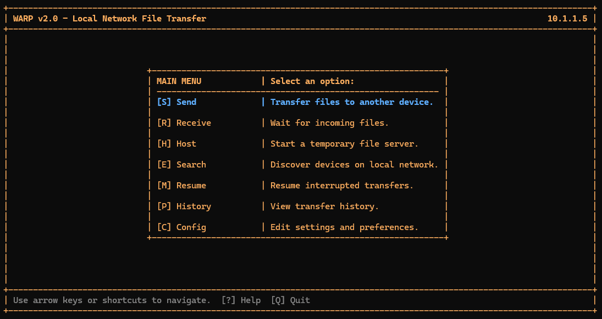
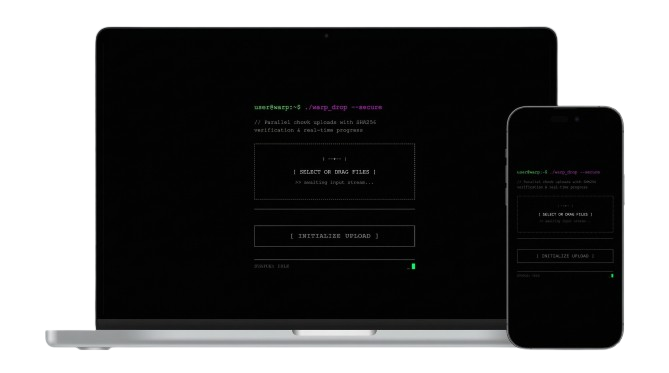

<div align="center">

# warp



Modern file transfer tool for local networks with interactive TUI, resumable transfers, and secure PAKE encryption.

[](https://pkg.go.dev/github.com/zulfikawr/warp)
[](https://go.dev/)
[](https://opensource.org/licenses/MIT)
[](https://github.com/zulfikawr/warp)

</div>

## Overview

**warp** is a high-performance, secure file transfer tool designed for local networks. It features both an interactive Terminal User Interface (TUI) and a traditional CLI, with support for resumable transfers, end-to-end encryption, and automatic service discovery.

### Key Features

- **🎨 Interactive TUI:** Beautiful terminal interface built with Bubble Tea - no command-line arguments needed!
- **⏸️ Resumable Transfers:** Pause, resume, or retry failed transfers with automatic checkpoint management
- **🔒 Secure by Default:** AES-256-GCM encryption with SPAKE2 PAKE key exchange using human-readable codes
- **🚀 High Performance:**
  - Parallel chunk uploads with intelligent buffer pooling (95% allocation reduction)
  - QUIC/HTTP3 support for optimized local transfers
  - Zero-copy sendfile on Linux for unencrypted transfers
  - Automatic zstd compression for compressible files
- **🔍 Auto-Discovery:** mDNS/DNS-SD service discovery - no manual IP addresses needed
- **📊 Real-Time Progress:** WebSocket-based progress tracking with pre-computed progress bars
- **⚙️ Flexible Configuration:** YAML config, environment variables, CLI flags with proper precedence
- **🌐 Web Upload Interface:** Terminal-styled drag-and-drop upload UI for browsers
- **📡 Monitoring:** Comprehensive Prometheus metrics for production deployments

## Table of Contents

- [Installation](#installation)
- [Usage Modes](#usage-modes)
  - [TUI Mode (Interactive)](#tui-mode-interactive)
  - [CLI Mode (Traditional)](#cli-mode-traditional)
- [Commands](#commands)
- [Configuration](#configuration)
- [API Reference](#api-reference)
- [Architecture](#architecture)
- [Contributing](#contributing)
- [License](#license)

## Installation

### From Go Package

```bash
go install github.com/zulfikawr/warp/cmd/warp@latest
```

### From Source

Requires Go 1.25 or higher:

```bash
git clone https://github.com/zulfikawr/warp.git
cd warp
go build -o warp ./cmd/warp
```

## Usage Modes

warp offers two distinct modes of operation to suit different workflows:

### TUI Mode (Interactive)

**Default mode** when you run `warp` without arguments. Provides a beautiful, interactive terminal interface built with [Bubble Tea](https://github.com/charmbracelet/bubbletea).

```bash
# Launch interactive TUI
warp
```

**Features:**

- 🏠 **Home Screen:** Quick access to all functions with keyboard shortcuts
- 📤 **Send:** Interactive file picker for selecting files/directories to share
- 📥 **Receive:** Easy-to-use download interface with auto-discovery
- 🏠 **Host:** Upload server with visual feedback and real-time progress
- 🔍 **Search:** Browse available warp services on your network
- ⚙️ **Config:** Interactive configuration editor
- 📜 **History:** View and manage past transfers
- ⏸️ **Resume:** Browse and resume interrupted transfers

**Navigation:**

- `↑/↓` or `j/k` - Navigate menu items
- `Enter` - Select/confirm
- `Esc` or `q` - Go back/quit
- `Ctrl+C` - Exit application
- `?` - Show help

### CLI Mode (Traditional)

**Command-line mode** for scripting, automation, and CI/CD pipelines. Explicit and scriptable.

```bash
# Force CLI mode (required for text output)
warp --cli <command> [args...]

# Examples:
warp send myfile.zip --cli
warp receive --code 7-apple-velocity --cli
warp host -d ./uploads --cli
warp history --cli
```

## Commands

### `warp send`

Start server to share file, directory, or text.

| Flag           | Short | Type   | Default | Required | Description                             |
| -------------- | ----- | ------ | ------- | -------- | --------------------------------------- |
| `--port`       | `-p`  | int    | random  | No       | Server port                             |
| `--interface`  | `-i`  | string | auto    | No       | Network interface to bind               |
| `--text`       |       | string |         | No       | Share text instead of file              |
| `--stdin`      |       | bool   | false   | No       | Read text from stdin                    |
| `--rate-limit` |       | float  | 0       | No       | Bandwidth limit in Mbps (0 = unlimited) |
| `--cache-size` |       | int    | 100     | No       | File cache size in MB                   |
| `--no-qr`      |       | bool   | false   | No       | Skip QR code display                    |
| `--no-encrypt` |       | bool   | false   | No       | Disable encryption (not recommended)    |
| `--verbose`    | `-v`  | bool   | false   | No       | Verbose logging                         |

**Arguments:**

- `<path>` - File or directory to share (required unless `--text` or `--stdin`)

---

### `warp host`

Start server to receive file uploads.

| Flag           | Short | Type   | Default | Required | Description                          |
| -------------- | ----- | ------ | ------- | -------- | ------------------------------------ |
| `--interface`  | `-i`  | string | auto    | No       | Network interface to bind            |
| `--dest`       | `-d`  | string | `.`     | No       | Destination directory for uploads    |
| `--rate-limit` |       | float  | 0       | No       | Bandwidth limit in Mbps              |
| `--no-qr`      |       | bool   | false   | No       | Skip QR code display                 |
| `--no-encrypt` |       | bool   | false   | No       | Disable encryption (not recommended) |
| `--verbose`    | `-v`  | bool   | false   | No       | Verbose logging                      |

---

### Web Upload Interface

Access the `/upload` endpoint in any browser for a terminal-styled upload interface.

<div align="center">



</div>

**Features:**

- **Terminal UI Design**: Retro ASCII-styled interface with ANSI colors
- **Drag & Drop**: Drop files anywhere or click to select
- **Multiple Files**: Upload multiple files simultaneously
- **Parallel Chunks**: Configurable workers (default: 3) and chunk size (default: 2MB)
- **Real-time Progress**:
  - Per-file progress bars
  - Live upload speed in Mbps
  - WebSocket connection status indicator
  - Percentage and status updates
- **Upload Controls**:
  - Pause/resume individual uploads with `[||]` / `[>]` buttons
  - Cancel uploads with `[x]` button
  - Per-file speed monitoring
- **SHA256 Verification**: Automatic checksum validation server-side
- **Session Management**: Unique session IDs prevent chunk conflicts
- **Status Indicators**:
  - WebSocket connection status (green = connected)
  - Real-time upload state (WAITING, UPLOADING, PAUSED, COMPLETE, ERROR)
  - Blinking cursor animation

---

### `warp receive`

Download file from warp server using a URL or PAKE code.

| Flag            | Short | Type   | Default | Required | Description                  |
| --------------- | ----- | ------ | ------- | -------- | ---------------------------- |
| `--output`      | `-o`  | string |         | No       | Output filename or directory |
| `--force`       | `-f`  | bool   | false   | No       | Overwrite existing files     |
| `--workers`     |       | int    | 3       | No       | Parallel download workers    |
| `--chunk-size`  |       | int    | 2       | No       | Chunk size in MB             |
| `--no-checksum` |       | bool   | false   | No       | Skip SHA256 verification     |
| `--decrypt`     |       | bool   | false   | No       | Decrypt with password        |
| `--verbose`     | `-v`  | bool   | false   | No       | Verbose logging              |

**Arguments:**

- `<code|url>` - Pake code or Server URL

---

### `warp search`

Discover warp servers on local network via mDNS.

| Flag        | Short | Type     | Default | Required | Description       |
| ----------- | ----- | -------- | ------- | -------- | ----------------- |
| `--timeout` |       | duration | 3s      | No       | Discovery timeout |

---

### `warp history`

View transfer history. Defaults to TUI mode.

| Flag    | Short | Type | Default | Required | Description         |
| ------- | ----- | ---- | ------- | -------- | ------------------- |
| `--cli` |       | bool | false   | No       | Output in text mode |

---

### `warp resume`

Manage interrupted transfers. Defaults to TUI mode.

| Flag    | Short | Type | Default | Required | Description         |
| ------- | ----- | ---- | ------- | -------- | ------------------- |
| `--cli` |       | bool | false   | No       | Output in text mode |

**Arguments:**

- `<session-id>` - (Optional) Session ID to resume immediately

---

### `warp config`

Manage configuration file.

**Subcommands:**

- `init` - Initialize configuration interactively
- `show` - Display current configuration
- `edit` - Open config in $EDITOR (defaults to vi)
- `path` - Show config file location

---

### `warp version`

Print version information.

---

## Configuration

### Configuration File

Location: `~/.config/warp/warp.yaml`

| Setting             | Type   | Default            | Description                     |
| ------------------- | ------ | ------------------ | ------------------------------- |
| `default_interface` | string | auto-detect        | Network interface to bind       |
| `default_port`      | int    | 0 (random)         | Server port                     |
| `buffer_size`       | int    | 1048576 (1MB)      | I/O buffer size in bytes        |
| `max_upload_size`   | int64  | 10737418240 (10GB) | Maximum upload size in bytes    |
| `rate_limit_mbps`   | float  | 0 (unlimited)      | Bandwidth limit in Mbps         |
| `cache_size_mb`     | int64  | 100                | File cache size in MB           |
| `chunk_size_mb`     | int    | 2                  | Chunk size for parallel uploads |
| `parallel_workers`  | int    | 3                  | Number of parallel workers      |
| `no_qr`             | bool   | false              | Skip QR code display            |
| `no_checksum`       | bool   | false              | Skip SHA256 verification        |
| `upload_dir`        | string | `.`                | Default upload directory        |

**Example:**

```yaml
default_interface: ""
default_port: 0
buffer_size: 1048576
max_upload_size: 10737418240
rate_limit_mbps: 0
cache_size_mb: 100
chunk_size_mb: 2
parallel_workers: 3
no_qr: false
no_checksum: false
upload_dir: "."
```

### Environment Variables

Override config with `WARP_` prefix:

```bash
export WARP_DEFAULT_PORT=9000
export WARP_RATE_LIMIT_MBPS=10
export WARP_CACHE_SIZE_MB=200
warp send file.zip
```

### Precedence

1. Command-line flags (highest)
2. Environment variables
3. Configuration file
4. Default values (lowest)

## API Reference

### Endpoints

| Method | Path            | Description                |
| ------ | --------------- | -------------------------- |
| GET    | `/d/{token}`    | Download file              |
| POST   | `/upload/chunk` | Upload file chunk          |
| GET    | `/api/info`     | Server and file info       |
| GET    | `/ws/progress`  | WebSocket progress updates |
| GET    | `/metrics`      | Prometheus metrics         |
| GET    | `/upload`       | Web upload interface       |
| GET    | `/health`       | Health check endpoint      |

### Headers

**Download (`GET /d/{token}`):**

- Response: `X-Checksum-SHA256` - File SHA256 hash

**Upload (`POST /upload/chunk`):**

- Request: `X-Upload-Session` - Session ID
- Request: `X-Chunk-Index` - Chunk index (0-based)
- Request: `X-Chunk-Offset` - Byte offset
- Request: `X-Total-Chunks` - Total chunks
- Request: `X-File-Name` - Filename

### Protocol Flow

**Download:**

1. Server generates token, advertises via mDNS
2. Client discovers or receives URL
3. Client GET `/d/{token}`
4. Server streams file (zero-copy on Linux)
5. Client verifies SHA256 checksum

**Upload:**

1. Client generates session ID
2. Client GET `/api/info`
3. Client splits file into chunks
4. Client POST `/upload/chunk` (parallel)
5. Server assembles and verifies checksum

## Architecture

### High-Level Overview

```
┌─────────────────────────────────────────────────────────────┐
│                         warp CLI                            │
│  ┌───────────────────┐              ┌────────────────────┐  │
│  │   TUI Mode        │              │    CLI Mode        │  │
│  │  (Bubble Tea)     │              │   (Traditional)    │  │
│  │                   │              │                    │  │
│  │ • Interactive UI  │              │ • Direct commands  │  │
│  │ • File picker     │              │ • Scriptable       │  │
│  │ • Resume manager  │              │ • Automation       │  │
│  └─────────┬─────────┘              └─────────┬──────────┘  │
│            │                                  │             │
│            └──────────────┬───────────────────┘             │
│                           │                                 │
│                    ┌──────▼──────┐                          │
│                    │   Core      │                          │
│                    │  Commands   │                          │
│                    └──────┬──────┘                          │
└───────────────────────────┼─────────────────────────────────┘
                            │
            ┌───────────────┼───────────────┐
            │               │               │
    ┌───────▼────┐   ┌──────▼─────┐  ┌─────▼──────┐
    │   Client   │   │   Server   │  │   Resume   │
    │            │   │            │  │   System   │
    │ • Upload   │   │ • HTTP/3   │  │            │
    │ • Download │   │ • PAKE     │  │ • Checkpnt │
    │ • PAKE     │   │ • Chunks   │  │ • Encrypt  │
    │ • Progress │   │ • Progress │  │ • Recover  │
    └────────────┘   └────────────┘  └────────────┘
```

### Components

| Component     | Location              | Purpose                                                               | Lines |
| ------------- | --------------------- | --------------------------------------------------------------------- | ----- |
| **TUI**       | `cmd/warp/tui/`       | Interactive terminal UI with Bubble Tea (16 files)                    | ~6000 |
| **CLI**       | `cmd/warp/cli/`       | Traditional command-line interface (7 files)                          | ~1500 |
| **Core**      | `internal/core/`      | Business logic executors for commands (6 files)                       | ~1200 |
| **Resume**    | `internal/resume/`    | Resumable transfer system (15 files, 22 test files)                   | ~4000 |
| **Server**    | `internal/server/`    | HTTP/QUIC server, chunks, PAKE, progress (18 files)                   | ~4500 |
| **Client**    | `internal/client/`    | HTTP client, parallel uploads/downloads, PAKE (6 files)               | ~1800 |
| **BufPool**   | `internal/bufpool/`   | Intelligent buffer pooling for memory optimization                    | ~100  |
| **Crypto**    | `internal/crypto/`    | AES-256-GCM encryption, SPAKE2 PAKE, token generation (7 files)       | ~900  |
| **Discovery** | `internal/discovery/` | mDNS/DNS-SD service advertisement and browsing                        | ~350  |
| **Protocol**  | `internal/protocol/`  | Transfer metadata, constants, handshake definitions (4 files)         | ~600  |
| **Metrics**   | `internal/metrics/`   | Prometheus metrics (modular: upload, download, cache, etc.) (8 files) | ~700  |
| **Config**    | `internal/config/`    | YAML configuration with environment variable support                  | ~250  |
| **Logging**   | `internal/logging/`   | Structured logging with zap (lazy initialization)                     | ~150  |
| **Network**   | `internal/network/`   | IP discovery and network utilities                                    | ~120  |
| **UI**        | `internal/ui/`        | Progress bars, QR codes, formatting utilities                         | ~200  |
| **Errors**    | `internal/errors/`    | User-friendly error types with suggestions                            | ~150  |

### Test

```bash
# All tests
go test ./...

# With race detector (recommended)
go test -race ./...

# With coverage
go test -cover ./...

# Specific package
go test -v ./internal/crypto

# Leak detection tests
go test -v -run TestServer_NoGoroutineLeaks ./internal/server/

# Nonce exhaustion tests
go test -v -run TestEncryptReader_NonceExhaustion ./internal/crypto/

# Coverage report
go test -coverprofile=coverage.out ./...
go tool cover -html=coverage.out
```

**Test Suite:**

- **Security:** Nonce exhaustion protection, filename sanitization (fuzz-tested with 239K+ iterations)
- **Reliability:** Goroutine leak detection, rate limiter cleanup, checksum cache validation
- **Concurrency:** Race detector clean across all packages
- **Quality:** Comprehensive unit tests, integration tests, end-to-end tests

### Code Quality

```bash
go fmt ./...          # Format
go vet ./...          # Vet
go mod tidy           # Clean dependencies
```

## Contributing

See [CONTRIBUTING.md](CONTRIBUTING.md).

1. Fork repository
2. Create feature branch
3. Add tests
4. Run `go test ./...`
5. Commit changes
6. Create Pull Request

## License

MIT License - see [LICENSE](LICENSE).

